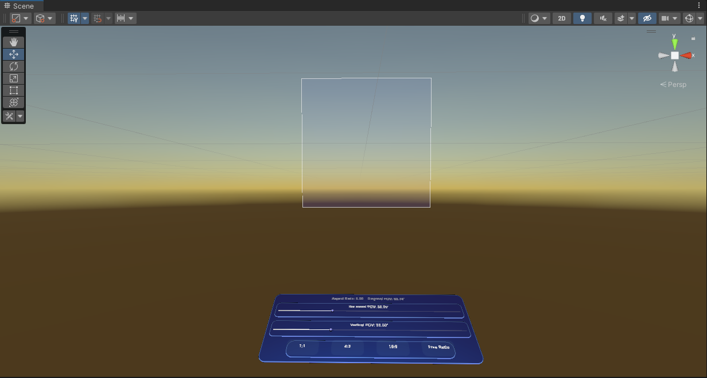

# Fov Previewer

**Fov Previewer** is an application that allows you to observe and experiment with various FOV dimensions.

## Preview

- **[Video Preview](https://www.notion.so/tinyyoung-foxmail-com-2af6fe8836e24c9fb30de54fb11d9284)**

<iframe src="[//player.bilibili.com/player.html?aid=389421234&bvid=BV1Bd4y1y7nR&cid=872317834&page=1](https://player.bilibili.com/player.html?aid=389421234&bvid=BV1Bd4y1y7nR&cid=872317834&page=1)" scrolling="no" border="0" frameborder="no" framespacing="0" allowfullscreen="true"> </iframe>

## Requirements

- Meta Quest 2 / Pro
- Enable developer mode (you can follow [these instructions](https://developer.oculus.com/documentation/native/android/mobile-device-setup/)).

## How to install?

1. [Download APK](https://github.com/fabio914/EyeTrackingKeyboard/releases/latest/download/build.apk).
2. Connect Quest to computer, use SideQuest or other ADB tools to install it.

## How to build?

1. Clone this project.
2. Open the project with Unity 2021.3 (Android Build).
3. Under **Project Settings**, navigate to **MRTK3**. For the profile, search and select **MRTKProfile** both fo**r Windows** and **Android** tab

### Enable Passthrough (optional)

1. On the **Hierarchy** tab, select **MRTK XR Rig**.
2. On the **Inspector** tab, from the bottom, click **Add Component**, and then from the list, select **OVRManager** and **OVRPassthroughLayer** script.
3. Refer to ****[Oculus developers](https://developer.oculus.com/documentation/unity/unity-passthrough/)**** for subsequent steps and other Settings.

